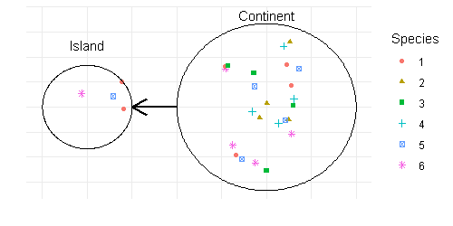
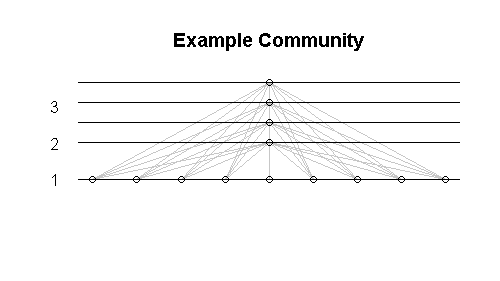

```{r setup, include=FALSE}
knitr::opts_chunk$set(echo = FALSE)
```

## The Project
<div class="columns-2">

Investigating the relationship between species translocation and biodiversity.

Comparing human driven effects to ecological and evolutionary effects.

Two sub-projects:

- Evolutionary/Species
- Ecological/Community

<br>
<br>
<br>
<br>
<br>
<br>

```{r, out.width="400px", out.height="200px"}
#
knitr::include_graphics("RemixKagawaTakimoto2017Fig1.png")
```

```{r, out.width="400px"}
#

```

</div>

## Law and Morton, 1996

Lotka-Volterra (Exploitation / Predator-Prey):

$$\frac{\mathrm{d}}{\mathrm{d}t}x_i = x_i \left(r_i + \sum_j a_{i,j} x_j \right) $$

- $x_i$: density of species $i$
- parentheses: per capita rate of increase
- $r_i$: growth rate
- $a_{i,j}$: effect of species $j$ on species $i$

## Community Scaling

<!--## Early Results (1)
Stronger dependence on basal species than on consumer species in the pool.

Larger pools $\implies$ larger communities, but non-trivially.-->

```{r loadDat, echo = FALSE, warning=FALSE,message=FALSE}
# Reserved Names
candidateData <- NULL
islandInteractionsOneEmptyTwoWhich <- NULL
islandInteractionsOneTwo <- NULL
islandInteractionsOneTwoWhich <- NULL
mats <- NULL
paramFrame <- NULL
plotScalingData <- NULL
pools <- NULL


ellipsisApply <- function(..., FUN) {
  lapply(as.list(...), FUN)
}

dirthis <- getwd()
dirdat <- file.path(dirthis,
                    "..",
                    "experiments")

load(file.path(dirdat, "LM1996-NumPoolCom-QDat-2021-05.RData"))
# Stop if not all are not null
stopifnot(all(unlist(ellipsisApply(
  FUN = function(bool) {!is.null(bool)},
  candidateData,
  islandInteractionsOneEmptyTwo,
  islandInteractionsOneEmptyTwoWhich,
  islandInteractionsOneTwo,
  islandInteractionsOneTwoWhich,
  mats,
  paramFrame,
  plotScalingData,
  pools
))))
```

```{r testPlot, echo=FALSE, warning=FALSE,message=FALSE, out.width="100%", out.height="100%"}
library(plotly)
#library(htmlwidgets)

plotScaling <- plotly::plot_ly(
  plotScalingData,
  x = ~Basals,
  y = ~Consumers,
  z = ~CommunitySize,
  color = ~Dataset,
  colors = c("red", "blue", "black")
)

plotScaling <- plotly::add_markers(plotScaling)

plotScaling <- plotly::layout(
  plotScaling,
  scene = list(
    xaxis = list(type = "log"),
    yaxis = list(type = "log"),
    camera = list(
      eye = list(
        x = -1.25, y = -1.25, z = .05
      )
    )
  )
)

plotScaling
```

<!--</div>-->

## Criticisms
- Size structure induces $\perp$ food webs.
```{r, out.width="400px"}
#

```

- Separation of time-scales.

- Strictly linear response.

## Island Interactions
Add dispersal to see how communities interact.

$$\frac{\mathrm{d}}{\mathrm{d}t}x_i = x_i \left(r_i + \sum_j a_{i,j} x_j \right) + \sum_j d_{i,j} x_j $$
- $d_{i,j}$: $>0$ if $i$ and $j$ are the same species on different islands and can move between islands. $<0$ if $i = j$ to conserve mass.

## Early Results
```{r}
load("islandcomparisonSimple.Rdata")
tempdata
```

## Early Results
Uninvadability to assembly is not the same as uninvadability to dispersal.

Primary productivity does not seem like a great predictor.

When a hybrid community emerges, it seems to propagate to all islands, even if it does not persist.

Hybrid communities that do persist seem to be invadable.

## Future Work
Currently:

- Working on testing explicitly if the mass effects $\implies$ invading the uninvadable.
- Looking for indirect mutualisms/competitions (so far, former not apparent).
- Modifying the pool (less connected, more mutual/competitive, self-regulation).

Later:

- Include dynamics on the pool.
- Integrate with evolutionary processes.
- Add more spatial dimension to the islands.
